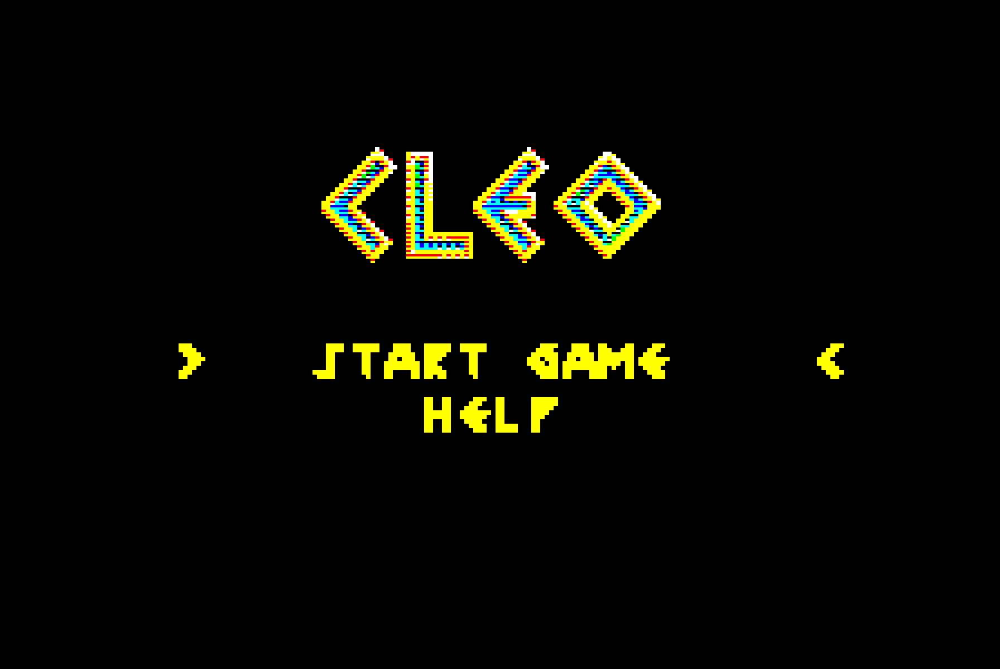
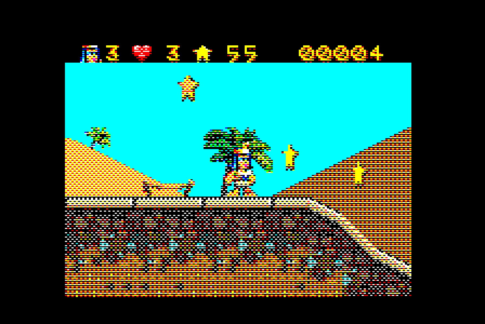

# Cleo — a BBC Master 128 port

*Cleo* is a scrolling platformer written for J2ME phones by High Energy Magic in 2004.
This repository ports it to the BBC Master 128: the whole game — eight worlds with
their bonus levels, all thirteen object types, the boomerang, the tune — running in
MODE 2 on a 2 MHz 6502 with smooth vertical scrolling, double buffering and a status
bar, from a single 200K disc image.

<p align="center">
  
  
</p>

## Playing it

Boot `beeb/cleo_latest.ssd` on a Master 128 — SHIFT+BREAK, or `*RUN CLEO` — or drop it
on [jsbeeb](https://bbc.godbolt.org) with the Master model selected.

| key | action |
|---|---|
| `Z` / `X` (or cursor left/right) | run |
| `RETURN` (or `SPACE`, cursor up) | jump |
| `/` (or cursor down) | throw the boomerang |
| `ESCAPE` | pause menu |

Collect every star in a level to open its bonus level. Menus use the cursor keys and
`RETURN`; the help screen's first line reads *Z X TO RUN* in the game's Egyptian font.

## Building

You need Python 3 with `Pillow` and `numpy`, [cc65](https://cc65.github.io) (`ca65`,
`ld65`), and the original game's assets unzipped from `CleoV500.jar` into `v500/` (the
JAR is not part of this repository).

```sh
cd beeb
python3 tools/convert.py   # levels, tiles, sprites, bar, title -> build/   (run this by hand)
./build.sh                 # tune, assemble, link, disc image -> build/cleo.ssd
```

`build.sh` does not run the converter, so re-run `convert.py` after touching anything in
the asset pipeline.

Build variants, all off by default and all leaving the standard build byte-identical:

```
DITHER=cpc python3 beeb/tools/convert.py   # 1x2 dither to the CPC's 27 colours
KERNEL=1x2 python3 beeb/tools/convert.py   # ordered dither with a 1x2 (or 2x2) kernel
MODE=1 python3 beeb/tools/convert.py && MODE1=1 ./build.sh   # a MODE 1 build
```

The MODE 1 build keeps the memory layout (a byte is still two game pixels, now as a
2x2 block of C/M/Y/K dots chosen per pixel) but loses the spare bits the MODE 2 engine
signals with. Sprite transparency comes from a mask plane instead: one bit per game
pixel, four columns' pairs packed into a byte, decoded by four page tables (`MASKTAB0..3`,
one per column phase, no shifting) into the AND mask for a data byte. No periodic-cell
flag in the tiles, a four-dot SWAPTAB for mirroring, a CMYK palette, and the font,
digits and bar spans live in bank 6 behind the box stars because the masks take the
room in bank 4. The assembler checks that the assets were converted for the mode it is
building.

## How it works, briefly

* **Picture.** MODE 2, 160×256, 8 colours. Each square game pixel becomes one MODE 2
  pixel wide and two scanlines tall, and the original's colours are approximated with a
  2×4 ordered dither chosen to be stable under the 2-pixel horizontal scroll step.
* **Scrolling.** Each 20K screen buffer is a 32-row ring; horizontal scrolling moves the
  CRTC start address by whole characters, vertical scrolling is per scanline using a
  vertical rupture — the frame is split into short CRTC frames (status bar, partial top
  row, playfield, partial bottom row, blanking) re-programmed from a VIA timer chain that
  re-phases itself every vsync.
* **Double buffering** between main and shadow RAM (ACCCON), with unchanged sprites kept
  in place rather than erased and redrawn.
* **Memory.** Engine below 12K, game logic and menus in HAZEL, all data in the four
  sideways RAM banks (sprites + font, tiles ×2, current level + title pack) and the
  4K ANDY RAM, loaded by a small WD1770 driver after abandoning the MOS.
* **Logic** is a line-by-line port of the original's `run()` with its integer arithmetic
  intact, stepping at 25 Hz with frame skipping.

The technical write-up is in [`beeb/README.md`](beeb/README.md); the notes on how the
J2ME engine and its data formats were reverse-engineered are in
[`beeb/docs/REVERSE_ENGINEERING.md`](beeb/docs/REVERSE_ENGINEERING.md).

## Tools

Everything under `beeb/tools/`:

| tool | purpose |
|---|---|
| `convert.py` | asset pipeline: level packs, tile banks, sprites, bar, title, previews |
| `mkdfs.py` | builds the DFS disc image and the sector table the loader uses |
| `midi2snd.py` | reduces `thm.mid` to a three-voice SN76489 note stream |
| `tile_editor.py` | hand-fix individual dithered tiles |
| `javadis.py` | Java class-file disassembler (no JVM required) |
| `profile.mjs`, `annotate_profile.py` | cycle-level profiler driving the jsbeeb core from Node, and a source annotator that draws a per-line cycle bar chart |
| `spawncheck.mjs`, `spritelog.mjs`, `barfrag.mjs` | scripted headless test runs: spawn points, sprite lists, framebuffer-vs-memory checks |

## Status

Playable start to finish. Not carried over from the phone version: saved progress and
hi-scores (kept in RAM only), the curtain wipe between screens and the "BONUS LEVEL"
banner sprite (drawn as text). The rendering runs at 12–25 fps depending on how much is
moving; the logic is fixed-rate so the game plays the same regardless.

## Credits

Original game © 2004 High Energy Magic. BBC Master port and tools in this repository by
Eben Upton with Claude; see the commit history for the blow-by-blow.
