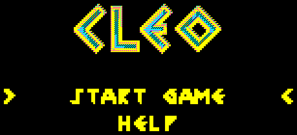
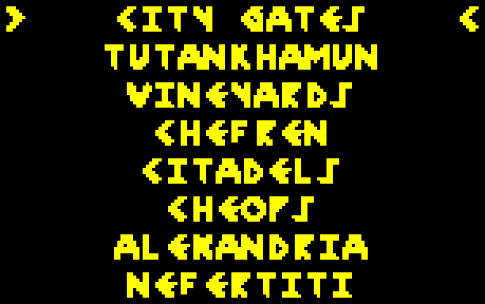
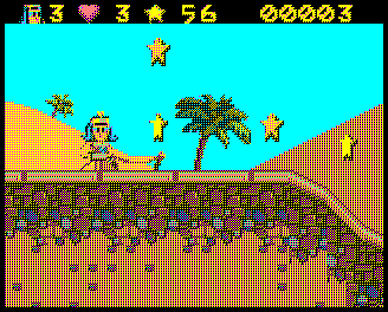
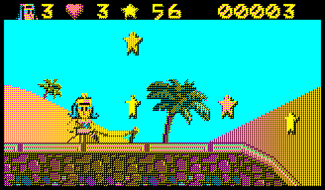
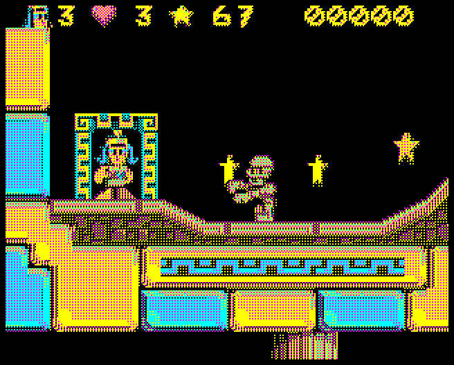

# Cleo for the BBC Micro

*Cleo* is a scrolling platformer written for J2ME phones by High Energy Magic in 2004.  This
repository ports it to the BBC Model B (with 64K of sideways RAM) and the BBC Master 128: all
sixteen levels -- eight worlds, each with its bonus level -- the thirteen object types, the
boomerang and the tune, in MODE 1 with smooth scrolling, from one 200K disc image that runs
on either machine.

<p align="center">
  
  
</p>
<p align="center">
  
  
</p>
<p align="center">
  
</p>

(Screenshots from the emulator's framebuffer, taken from the disc in this repository; the
Model B's window is 84 game pixels tall to the Master's 120, the one visible difference
between the machines.)

## Playing it

Boot `cleo.ssd` (SHIFT+BREAK; `!BOOT` runs the loader) on either machine, or load it into
[jsbeeb](https://bbc.godbolt.org) or BeebEm as a Master 128 or a Model B.

- **Master 128**: as it comes.
- **Model B**: four 16K banks of sideways RAM in any sockets, written through ROMSEL or by a
  Watford or Solidisk write-select board, and an 8271 or Acorn 1770 DFS.  The loader finds
  the banks, tells you if it cannot, and patches the game for the ones it finds.

| key | action |
|---|---|
| `Z` / `X`, or cursor left / right | run |
| `RETURN`, `SPACE`, or `:` / cursor up | jump |
| `/`, or cursor down | throw the boomerang |

Menus: cursor up and down move, `RETURN` (or cursor right) selects.  Collect every star in a
level to open its bonus level; a level finished with stars left goes straight to the next
world.  Once you have reached a world the level select offers it.  There is no pause.

## Building

You need Python 3 with Pillow and numpy, and [cc65](https://cc65.github.io) (`ca65`, `ld65`,
`od65`).  The original game's data is in the repository, unzipped from the JARs into
`beeb/assets/` (`v500/`, the build's input; `gx/`, for reference).  The engine is a submodule.

```sh
git submodule update --init   # beebgame, in beeb/beebgame
cd beeb
sh build.sh                   # the tune, the assets, both machines, one disc: build/cleo.ssd
```

A plain build also copies the disc to this directory's `cleo.ssd`, the copy kept in git.
Knobs: `NFLAT=n sh build.sh` (flat tiles a level, default 4), `ALLLEVELS=1 sh build.sh` (a
test build with every world on the level select, which takes every bonus level and does not
overwrite `cleo.ssd`).

## What is where

- `beeb/` -- the port: the game's 6502 sources, the asset pipeline, the tests and the build
  (`beeb/README.md` is the developer's index).
- `beeb/beebgame/` -- the engine, [beebgame](https://github.com/ebenupton/beebgame), as a
  submodule: display, blitters, disc driver and loader, level file format.
- `beeb/docs/` -- `DESIGN.md` (the game's design) and `REVERSE_ENGINEERING.md` (what was
  learned from the J2ME original, for the next port); `history/` keeps earlier plans.
- `cleo.ssd` -- the disc, as last built.

## Status

Everything in the original's levels plays.  Not ported: the hi-score's persistence (it lives
in RAM, cleared at power-on), the curtain "wipe" between screens, and the BONUS LEVEL banner
sprite (the words appear only on the help page).

## Credits

*Cleo* was written by High Energy Magic (2004).  The port's engine is beebgame; the tests run
on jsbeeb (Matt Godbolt) and a headless build of BeebEm's core; the assembler is cc65.
